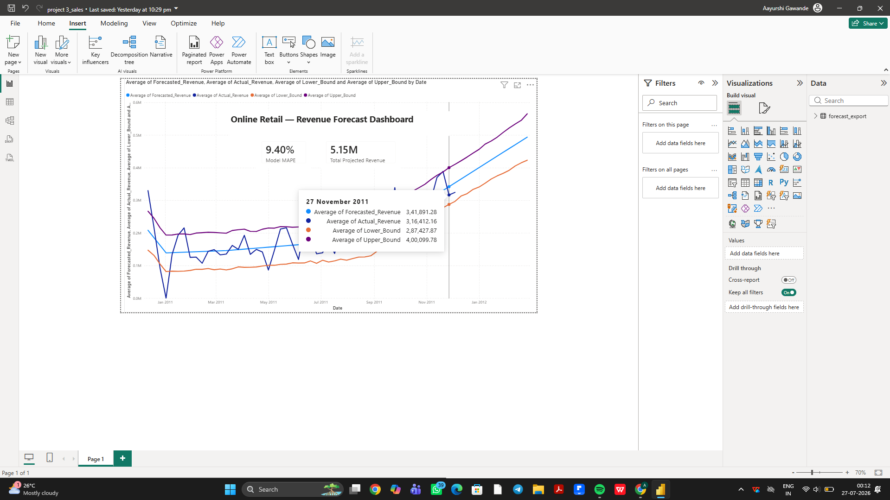

# Sales Forecasting with Facebook Prophet 📈

Time-series forecasting project predicting weekly revenue for an online retail business, using **Facebook Prophet**. Includes model validation against held-out actuals, hyperparameter tuning, and an interactive Power BI dashboard for business stakeholders.

## Business Problem

Retail businesses need to anticipate near-term revenue to plan inventory, staffing, and cash flow. This project builds a forecasting model on historical weekly sales data to project revenue 12 weeks (one quarter) into the future, while being transparent about the model's confidence and limitations.

## Dataset

- **Source:** [UCI Online Retail Dataset](https://archive.ics.uci.edu/dataset/352/online+retail) — transactional data from a UK-based online retailer (Dec 2010 – Dec 2011)
- **Raw size:** 541,909 transaction line items
- **Cleaning:** Removed returns/cancellations (negative quantity) and invalid entries (negative/zero unit price) → 530,104 clean transaction rows
- **Aggregation:** Rolled up into weekly revenue totals; trimmed partial weeks at the start and end of the dataset to leave **52 full weeks** of clean, comparable data

## Methodology

### 1. Time-based train/test split
Unlike random splits used in classification/clustering, time-series data must be split chronologically — the model can only be evaluated on its ability to predict *future* periods from *past* ones.
- **Train:** first 44 weeks
- **Test:** final 8 weeks (Oct–Dec 2011, the holiday ramp-up period)

### 2. Baseline model
Fit Prophet with `yearly_seasonality`, `weekly_seasonality`, and `daily_seasonality` all disabled — with only 1 year of data, yearly seasonality can't be reliably learned, and weekly/daily seasonality is meaningless at weekly-aggregated resolution.

**Baseline result:** MAE £91,750 | RMSE £103,302 | MAPE 28.0%

The baseline significantly **underpredicted** revenue during the test period. With Prophet's default `changepoint_prior_scale=0.05`, the model's trend line was too rigid to capture the sharp holiday-season acceleration in the data — it just extrapolated the gentle earlier slope forward.

### 3. Hyperparameter tuning
Swept `changepoint_prior_scale` (which controls how flexible Prophet's trend line is allowed to be) across `[0.1, 0.3, 0.5, 0.8, 1.0]`:

| changepoint_prior_scale | MAE | MAPE |
|---|---|---|
| 0.1 | £92,056 | 28.1% |
| 0.3 | £60,568 | 18.0% |
| 0.5 | £39,099 | 11.6% |
| **0.8** | **£29,452** | **9.4%** |
| 1.0 | £31,562 | 10.2% |

Error decreased steadily up to `0.8`, then began rising again at `1.0` — a classic overfitting signature. **`changepoint_prior_scale = 0.8`** was selected as it minimized test error without chasing short-term noise.

**Improvement over baseline:** MAE reduced by 57%, MAPE reduced from 28.0% → 9.4%.

### 4. Final forecast
Retrained the tuned model on all 52 weeks of data (train + test combined) and generated a **12-week (one quarter) forward forecast**.

## Key Results

- **Total projected revenue, next 12 weeks:** £5.15M
- **Validated model accuracy:** MAPE 9.4% on held-out test data
- Clear seasonal insight: revenue shows a strong upward ramp from **September onward**, consistent with holiday retail demand

## Limitations

- Only 1 year of historical data was available, so **true yearly seasonality could not be modeled** — the forecast is trend-based only
- As a result, the model likely **overstates revenue into January/February**, since it has no way to anticipate the typical post-holiday retail slowdown
- A genuine zero-revenue week (New Year's, Dec 27 – Jan 2) was identified as a real business pattern rather than a data error, and was retained in the dataset

## Tools Used

- **Python (Google Colab):** pandas, Facebook Prophet, matplotlib, scikit-learn (evaluation metrics)
- **Power BI Desktop:** Interactive dashboard with actual-vs-forecast Line Chart and KPI Cards

## Dashboard Preview



The Power BI dashboard includes:
- **Line Chart:** Actual Revenue vs. Forecasted Revenue with 95% confidence interval bounds, plotted weekly
- **Card visual:** Total Projected Revenue (next 12 weeks)
- **Card visual:** Model MAPE (validated accuracy)

## Repository Structure

```
sales-forecasting-prophet/
├── sales_forecasting_prophet.ipynb   # Full Colab notebook: cleaning → modeling → tuning → forecast
├── forecast_export.csv               # Forecast output (for Power BI)
├── final_forecast_chart.png          # Actual vs. forecast visualization
├── dashboard_screenshot.png          # Power BI dashboard screenshot
└── README.md
```

## Author

**Aayurshi Gawande** — Final-year B.E. Electronics & Telecommunication, St. Francis Institute of Technology, Mumbai
[GitHub](https://github.com/Aayurshi07)
